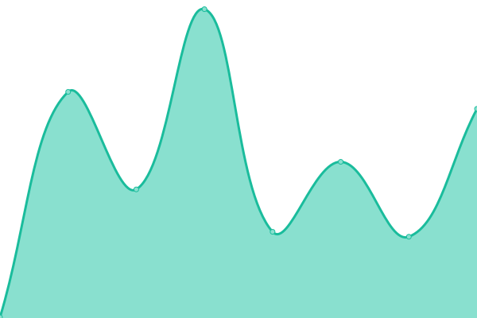
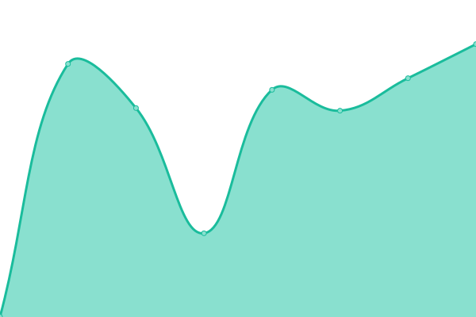
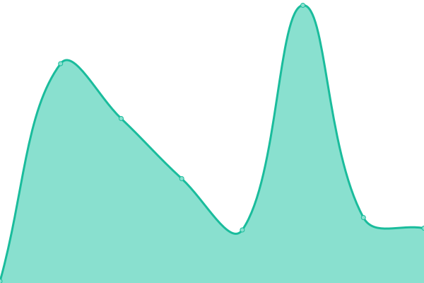
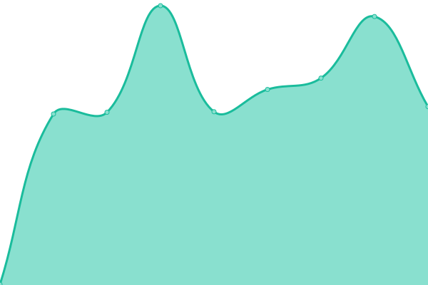

# [📈 Live Status](https://status.solveitonce.com): <!--live status--> **🟩 All systems operational**

This repository contains the open-source uptime monitor and status page for [Solve it once](https://solveitonce.com), powered by [Upptime](https://github.com/upptime/upptime).

With [Upptime](https://upptime.js.org), you can get your own unlimited and free uptime monitor and status page, powered entirely by a GitHub repository. We use [Issues](https://github.com/solve-it-once/upptime/issues) as incident reports, [Actions](https://github.com/solve-it-once/upptime/actions) as uptime monitors, and [Pages](https://status.solveitonce.com) for the status page.

Live status: <!--live status--> **🟩 All systems operational**

## ⭐ How it works

- GitHub Actions is used as an uptime monitor
  - Every 5 minutes, a workflow visits your website to make sure it's up
  - Response time is recorded every 6 hours and committed to git
  - Graphs of response time are generated every day
- GitHub Issues is used for incident reports
  - An issue is opened if an endpoint is down
  - People from your team are assigned to the issue
  - Incidents reports are posted as issue comments
  - Issues are locked so non-members cannot comment on them
  - Issues are closed automatically when your site comes back up
  - Slack notifications are sent on updates
- GitHub Pages is used for the status website
  - A simple, beautiful, and accessible PWA is generated
  - Built with Svelte and Sapper
  - Fetches data from this repository using the GitHub API

## [📈 Status](https://upptime.js.org)

_This section is updated automatically when the status of any site changes._

<!--start: status pages-->
<!-- This summary is generated by Upptime (https://github.com/upptime/upptime) -->
<!-- Do not edit this manually, your changes will be overwritten -->
<!-- prettier-ignore -->
| URL | Status | History | Response Time | Uptime |
| --- | ------ | ------- | ------------- | ------ |
|  [Solve it once](https://solveitonce.com) | 🟩 Up | [solve-it-once.yml](https://github.com/solve-it-once/upptime/commits/HEAD/history/solve-it-once.yml) | 

 111ms
     
 | 

<a href="https://status.solveitonce.com/history/solve-it-once">100.00%</a>
    

|  [Brad Czerniak](https://bradczerniak.com) | 🟩 Up | [brad-czerniak.yml](https://github.com/solve-it-once/upptime/commits/HEAD/history/brad-czerniak.yml) | 

 119ms
     
 | 

<a href="https://status.solveitonce.com/history/brad-czerniak">100.00%</a>
    

|  [Shelby Brad](https://shelbybrad.com) | 🟩 Up | [shelby-brad.yml](https://github.com/solve-it-once/upptime/commits/HEAD/history/shelby-brad.yml) | 

 123ms
     
 | 

<a href="https://status.solveitonce.com/history/shelby-brad">100.00%</a>
    

|  [Lower Barriers](https://lowerbarriers.org) | 🟩 Up | [lower-barriers.yml](https://github.com/solve-it-once/upptime/commits/HEAD/history/lower-barriers.yml) | 

 227ms
     
 | 

<a href="https://status.solveitonce.com/history/lower-barriers">100.00%</a>
    

|  [Zenput](https://www.zenput.com) | 🟩 Up | [zenput.yml](https://github.com/solve-it-once/upptime/commits/HEAD/history/zenput.yml) | 

 103ms
     
 | 

<a href="https://status.solveitonce.com/history/zenput">100.00%</a>
    

|  [iqstrategix](https://www.iqstrategix.com) | 🟩 Up | [iqstrategix.yml](https://github.com/solve-it-once/upptime/commits/HEAD/history/iqstrategix.yml) | 

 174ms
     
 | 

<a href="https://status.solveitonce.com/history/iqstrategix">100.00%</a>
    

|  [pgc](https://www.princegeorgescountymd.gov) | 🟩 Up | [pgc.yml](https://github.com/solve-it-once/upptime/commits/HEAD/history/pgc.yml) | 

 729ms
     
 | 

<a href="https://status.solveitonce.com/history/pgc">100.00%</a>
    

|  [deneau](https://electdeneau.github.io) | 🟩 Up | [deneau.yml](https://github.com/solve-it-once/upptime/commits/HEAD/history/deneau.yml) | 

 92ms
     
 | 

<a href="https://status.solveitonce.com/history/deneau">100.00%</a>
    

|  [frost](https://www.frostdrupal.com) | 🟩 Up | [frost.yml](https://github.com/solve-it-once/upptime/commits/HEAD/history/frost.yml) | 

 194ms
     
 | 

<a href="https://status.solveitonce.com/history/frost">100.00%</a>
    

|  [diamondchallenge](https://diamondchallenge.org) | 🟩 Up | [diamondchallenge.yml](https://github.com/solve-it-once/upptime/commits/HEAD/history/diamondchallenge.yml) | 

 4272ms
     
 | 

<a href="https://status.solveitonce.com/history/diamondchallenge">100.00%</a>
    

<!--end: status pages-->

## 👩‍💻 Getting started

1. Create a new repository [using this template](https://github.com/koj-co/upptime/generate)
2. Update the [`.upptimerc.yml`](./.upptimerc.yml) file with your configuration
3. Enable publishing the `gh-pages` branch for your status website and add a `GH_PAT`

### Concepts

#### Issues as incidents

When the GitHub Actions workflow detects that one of your URLs is down, it automatically opens a GitHub issue ([example issue #15](https://github.com/koj-co/upptime/issues/15)). You can add incident reports to this issue by adding comments. When your site comes back up, the issue will be closed automatically as well.

<table>
  <tr>
    <td>
      
    </td>
    <td>
      
    </td>
  </tr>
</table>

#### Commits for response time

Four times per day, another workflow runs and records the response time of your websites. This data is commited to GitHub, so it's available in the commit history of each file ([example commit history](https://github.com/koj-co/upptime/commits/master/history/wikipedia.yml)). Then, the GitHub API is used to graph the response time history of each endpoint and to track when a site went down.

<table>
  <tr>
    <td>
      
    </td>
    <td>
      
    </td>
  </tr>
</table>
<!--end: docs-->

## 📄 License

- Code: [MIT](./LICENSE) © [Solve it once](https://solveitonce.com)
- Data in the `./history` directory: [Open Database License](https://opendatacommons.org/licenses/odbl/1-0/)
