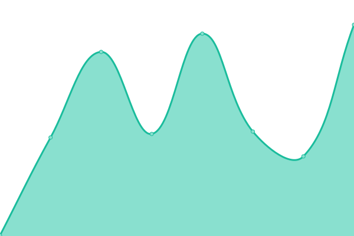
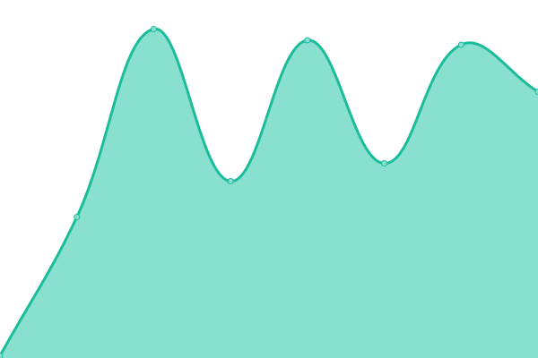

# [📈 Live Status](https://status.solveitonce.com): <!--live status--> **🟧 Partial outage**

This repository contains the open-source uptime monitor and status page for [Solve it once](https://solveitonce.com), powered by [Upptime](https://github.com/upptime/upptime).

With [Upptime](https://upptime.js.org), you can get your own unlimited and free uptime monitor and status page, powered entirely by a GitHub repository. We use [Issues](https://github.com/solve-it-once/upptime/issues) as incident reports, [Actions](https://github.com/solve-it-once/upptime/actions) as uptime monitors, and [Pages](https://status.solveitonce.com) for the status page.

Upptime is used by [**1,000+**](https://github.com/topics/upptime) people and teams to ensure they know when their endpoints go down.

<!--end: description-->

<!--start: status pages-->
<!-- This summary is generated by Upptime (https://github.com/upptime/upptime) -->
<!-- Do not edit this manually, your changes will be overwritten -->
<!-- prettier-ignore -->
| URL | Status | History | Response Time | Uptime |
| --- | ------ | ------- | ------------- | ------ |
|  [Solve it once](https://solveitonce.com) | 🟩 Up | [solve-it-once.yml](https://github.com/solve-it-once/upptime/commits/HEAD/history/solve-it-once.yml) | 

 229ms
     
 | 

<a href="https://status.solveitonce.com/history/solve-it-once">100.00%</a>
    

|  [Brad Czerniak](https://bradczerniak.com) | 🟩 Up | [brad-czerniak.yml](https://github.com/solve-it-once/upptime/commits/HEAD/history/brad-czerniak.yml) | 

 169ms
     
 | 

<a href="https://status.solveitonce.com/history/brad-czerniak">100.00%</a>
    

|  [Shelby Brad](https://shelbybrad.com) | 🟩 Up | [shelby-brad.yml](https://github.com/solve-it-once/upptime/commits/HEAD/history/shelby-brad.yml) | 

 182ms
     
 | 

<a href="https://status.solveitonce.com/history/shelby-brad">100.00%</a>
    

|  [Lower Barriers](https://lowerbarriers.org) | 🟩 Up | [lower-barriers.yml](https://github.com/solve-it-once/upptime/commits/HEAD/history/lower-barriers.yml) | 

 242ms
     
 | 

<a href="https://status.solveitonce.com/history/lower-barriers">100.00%</a>
    

|  [Zenput](https://www.zenput.com) | 🟩 Up | [zenput.yml](https://github.com/solve-it-once/upptime/commits/HEAD/history/zenput.yml) | 

 174ms
     
 | 

<a href="https://status.solveitonce.com/history/zenput">100.00%</a>
    

|  [pgc](https://www.princegeorgescountymd.gov) | 🟩 Up | [pgc.yml](https://github.com/solve-it-once/upptime/commits/HEAD/history/pgc.yml) | 

 380ms
     
 | 

<a href="https://status.solveitonce.com/history/pgc">100.00%</a>
    

|  [deneau](https://electdeneau.github.io) | 🟩 Up | [deneau.yml](https://github.com/solve-it-once/upptime/commits/HEAD/history/deneau.yml) | 

 85ms
     
 | 

<a href="https://status.solveitonce.com/history/deneau">100.00%</a>
    

|  [frost](https://www.frostdrupal.com) | 🟩 Up | [frost.yml](https://github.com/solve-it-once/upptime/commits/HEAD/history/frost.yml) | 

 289ms
     
 | 

<a href="https://status.solveitonce.com/history/frost">100.00%</a>
    

|  [Stemteachers](https://stemteachers.asu.edu) | 🟩 Up | [stemteachers.yml](https://github.com/solve-it-once/upptime/commits/HEAD/history/stemteachers.yml) | 

 899ms
     
 | 

<a href="https://status.solveitonce.com/history/stemteachers">100.00%</a>
    

|  [WalkUHome](https://walkuhome.com) | 🟩 Up | [walk-u-home.yml](https://github.com/solve-it-once/upptime/commits/HEAD/history/walk-u-home.yml) | 

 285ms
     
 | 

<a href="https://status.solveitonce.com/history/walk-u-home">100.00%</a>
    

|  [MGoBlog](https://mgoblog.com) | 🟩 Up | [m-go-blog.yml](https://github.com/solve-it-once/upptime/commits/HEAD/history/m-go-blog.yml) | 

 224ms
     
 | 

<a href="https://status.solveitonce.com/history/m-go-blog">100.00%</a>
    

|  [ICI SFF](https://www.securefinancialfuture.org) | 🟩 Up | [ici-sff.yml](https://github.com/solve-it-once/upptime/commits/HEAD/history/ici-sff.yml) | 

 401ms
     
 | 

<a href="https://status.solveitonce.com/history/ici-sff">100.00%</a>
    

|  [World Challenge](https://worldchallenge.org) | 🟩 Up | [world-challenge.yml](https://github.com/solve-it-once/upptime/commits/HEAD/history/world-challenge.yml) | 

 570ms
     
 | 

<a href="https://status.solveitonce.com/history/world-challenge">100.00%</a>
    

|  [rf IDEAS](https://www.rfideas.com) | 🟩 Up | [rf-ideas.yml](https://github.com/solve-it-once/upptime/commits/HEAD/history/rf-ideas.yml) | 

 334ms
     
 | 

<a href="https://status.solveitonce.com/history/rf-ideas">100.00%</a>
    

|  [FDH](https://www.firstdentalhealth.com) | 🟩 Up | [fdh.yml](https://github.com/solve-it-once/upptime/commits/HEAD/history/fdh.yml) | 

 91ms
     
 | 

<a href="https://status.solveitonce.com/history/fdh">100.00%</a>
    

|  [fibercore](https://fibercore.humaneticsgroup.com) | 🟩 Up | [fibercore.yml](https://github.com/solve-it-once/upptime/commits/HEAD/history/fibercore.yml) | 

 308ms
     
 | 

<a href="https://status.solveitonce.com/history/fibercore">100.00%</a>
    

|  [optek](https://optek.humaneticsgroup.com) | 🟩 Up | [optek.yml](https://github.com/solve-it-once/upptime/commits/HEAD/history/optek.yml) | 

 280ms
     
 | 

<a href="https://status.solveitonce.com/history/optek">100.00%</a>
    

|  [hitec](https://hitec.humaneticsgroup.com) | 🟩 Up | [hitec.yml](https://github.com/solve-it-once/upptime/commits/HEAD/history/hitec.yml) | 

 236ms
     
 | 

<a href="https://status.solveitonce.com/history/hitec">100.00%</a>
    

|  [humanetics](https://www.humaneticsgroup.com) | 🟩 Up | [humanetics.yml](https://github.com/solve-it-once/upptime/commits/HEAD/history/humanetics.yml) | 

 267ms
     
 | 

<a href="https://status.solveitonce.com/history/humanetics">100.00%</a>
    

|  [sparrow](https://www.sparrow.org) | 🟩 Up | [sparrow.yml](https://github.com/solve-it-once/upptime/commits/HEAD/history/sparrow.yml) | 

 150ms
     
 | 

<a href="https://status.solveitonce.com/history/sparrow">100.00%</a>
    

|  [NDC](https://www.newdentalchoice.com) | 🟩 Up | [ndc.yml](https://github.com/solve-it-once/upptime/commits/HEAD/history/ndc.yml) | 

 139ms
     
 | 

<a href="https://status.solveitonce.com/history/ndc">100.00%</a>
    

|  [EDS](https://www.employersdental.com) | 🟩 Up | [eds.yml](https://github.com/solve-it-once/upptime/commits/HEAD/history/eds.yml) | 

 291ms
     
 | 

<a href="https://status.solveitonce.com/history/eds">100.00%</a>
    

|  [DDS](https://www.diversifieddental.com) | 🟩 Up | [dds.yml](https://github.com/solve-it-once/upptime/commits/HEAD/history/dds.yml) | 

 259ms
     
 | 

<a href="https://status.solveitonce.com/history/dds">100.00%</a>
    

|  [LSI](https://www.lightingservicesinc.com) | 🟥 Down | [lsi.yml](https://github.com/solve-it-once/upptime/commits/HEAD/history/lsi.yml) | 

 92ms
     
 | 

<a href="https://status.solveitonce.com/history/lsi">0.00%</a>
    

<!--end: status pages-->

[**Visit our status website →**](https://status.solveitonce.com)undefined
