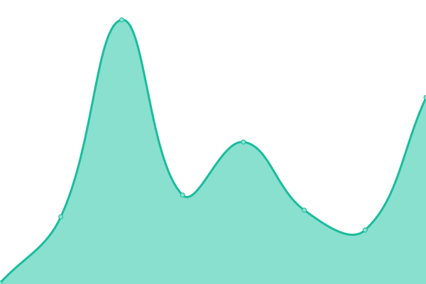

# [📈 Live Status](https://status.solveitonce.com): <!--live status--> **🟩 All systems operational**

This repository contains the open-source uptime monitor and status page for [Solve it once](https://solveitonce.com), powered by [Upptime](https://github.com/upptime/upptime).

With [Upptime](https://upptime.js.org), you can get your own unlimited and free uptime monitor and status page, powered entirely by a GitHub repository. We use [Issues](https://github.com/solve-it-once/upptime/issues) as incident reports, [Actions](https://github.com/solve-it-once/upptime/actions) as uptime monitors, and [Pages](https://status.solveitonce.com) for the status page.

Upptime is used by [**1,000+**](https://github.com/topics/upptime) people and teams to ensure they know when their endpoints go down.

<!--end: description-->

<!--start: status pages-->
<!-- This summary is generated by Upptime (https://github.com/upptime/upptime) -->
<!-- Do not edit this manually, your changes will be overwritten -->
<!-- prettier-ignore -->
| URL | Status | History | Response Time | Uptime |
| --- | ------ | ------- | ------------- | ------ |
|  [Solve it once](https://solveitonce.com) | 🟩 Up | [solve-it-once.yml](https://github.com/solve-it-once/upptime/commits/HEAD/history/solve-it-once.yml) | 

 258ms
     
 | 

<a href="https://status.solveitonce.com/history/solve-it-once">100.00%</a>
    

|  [Brad Czerniak](https://bradczerniak.com) | 🟩 Up | [brad-czerniak.yml](https://github.com/solve-it-once/upptime/commits/HEAD/history/brad-czerniak.yml) | 

 236ms
     
 | 

<a href="https://status.solveitonce.com/history/brad-czerniak">100.00%</a>
    

|  [Shelby Brad](https://shelbybrad.com) | 🟩 Up | [shelby-brad.yml](https://github.com/solve-it-once/upptime/commits/HEAD/history/shelby-brad.yml) | 

 214ms
     
 | 

<a href="https://status.solveitonce.com/history/shelby-brad">100.00%</a>
    

|  [Lower Barriers](https://lowerbarriers.org) | 🟩 Up | [lower-barriers.yml](https://github.com/solve-it-once/upptime/commits/HEAD/history/lower-barriers.yml) | 

 341ms
     
 | 

<a href="https://status.solveitonce.com/history/lower-barriers">100.00%</a>
    

|  [Zenput](https://www.zenput.com) | 🟩 Up | [zenput.yml](https://github.com/solve-it-once/upptime/commits/HEAD/history/zenput.yml) | 

 147ms
     
 | 

<a href="https://status.solveitonce.com/history/zenput">100.00%</a>
    

|  [frost](https://www.frostdrupal.com) | 🟩 Up | [frost.yml](https://github.com/solve-it-once/upptime/commits/HEAD/history/frost.yml) | 

 303ms
     
 | 

<a href="https://status.solveitonce.com/history/frost">100.00%</a>
    

|  [MGoBlog](https://mgoblog.com) | 🟩 Up | [m-go-blog.yml](https://github.com/solve-it-once/upptime/commits/HEAD/history/m-go-blog.yml) | 

 274ms
     
 | 

<a href="https://status.solveitonce.com/history/m-go-blog">99.30%</a>
    

|  [FDH](https://www.firstdentalhealth.com) | 🟩 Up | [fdh.yml](https://github.com/solve-it-once/upptime/commits/HEAD/history/fdh.yml) | 

 111ms
     
 | 

<a href="https://status.solveitonce.com/history/fdh">100.00%</a>
    

|  [NDC](https://www.newdentalchoice.com) | 🟩 Up | [ndc.yml](https://github.com/solve-it-once/upptime/commits/HEAD/history/ndc.yml) | 

 126ms
     
 | 

<a href="https://status.solveitonce.com/history/ndc">100.00%</a>
    

|  [EDS](https://www.employersdental.com) | 🟩 Up | [eds.yml](https://github.com/solve-it-once/upptime/commits/HEAD/history/eds.yml) | 

 125ms
     
 | 

<a href="https://status.solveitonce.com/history/eds">100.00%</a>
    

|  [DDS](https://www.diversifieddental.com) | 🟩 Up | [dds.yml](https://github.com/solve-it-once/upptime/commits/HEAD/history/dds.yml) | 

 132ms
     
 | 

<a href="https://status.solveitonce.com/history/dds">100.00%</a>
    

|  [EqRes](https://equinoxresidential.com) | 🟩 Up | [eq-res.yml](https://github.com/solve-it-once/upptime/commits/HEAD/history/eq-res.yml) | 

 167ms
     
 | 

<a href="https://status.solveitonce.com/history/eq-res">100.00%</a>
    

|  [Principal](https://www.principal.com) | 🟩 Up | [principal.yml](https://github.com/solve-it-once/upptime/commits/HEAD/history/principal.yml) | 

 96ms
     
 | 

<a href="https://status.solveitonce.com/history/principal">100.00%</a>
    

|  [Elevate](https://www.elevatebyprincipal.com) | 🟩 Up | [elevate.yml](https://github.com/solve-it-once/upptime/commits/HEAD/history/elevate.yml) | 

 1176ms
     
 | 

<a href="https://status.solveitonce.com/history/elevate">100.00%</a>
    

|  [Foundation](https://principalfoundation.org) | 🟩 Up | [foundation.yml](https://github.com/solve-it-once/upptime/commits/HEAD/history/foundation.yml) | 

 480ms
     
 | 

<a href="https://status.solveitonce.com/history/foundation">100.00%</a>
    

<!--end: status pages-->

[**Visit our status website →**](https://status.solveitonce.com)undefined
